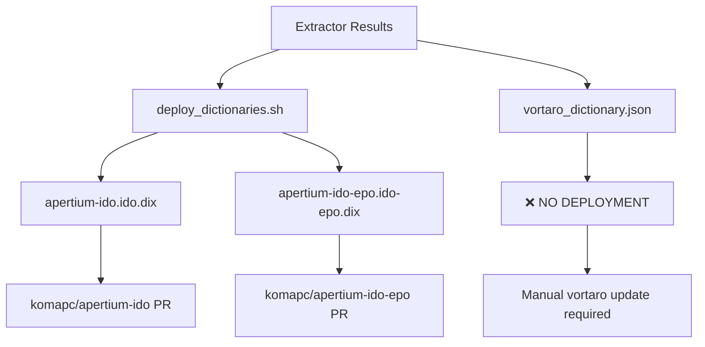
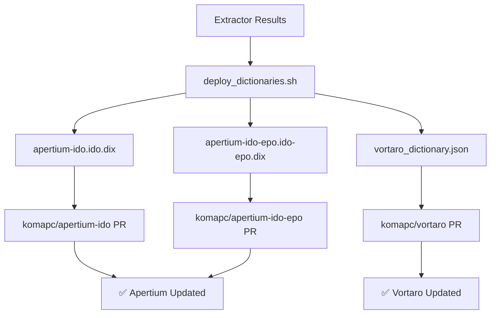

# Deployment Analysis - Current State vs. Requirements

## 🎯 Current Deployment Status

### ✅ **What Works**
The current `deploy_dictionaries.sh` script correctly deploys:
- **Monolingual dictionary**: `apertium-ido.ido.dix` → `komapc/apertium-ido`
- **Bilingual dictionary**: `apertium-ido-epo.ido-epo.dix` → `komapc/apertium-ido-epo`

### ❌ **What's Missing**
The deployment script **does NOT** deploy to vortaro, which means:
- **Vortaro website** doesn't get updated with new dictionary data
- **Manual deployment** required for vortaro updates
- **Incomplete automation** - only Apertium repos get updated

## 📊 Current Deployment Flow



## 🎯 Required Deployment Flow



## 📋 Files Generated by Extractor

### **Current Output** (`projects/extractor/dist/`)
- ✅ `apertium-ido.ido.dix` - Monolingual dictionary (deployed)
- ✅ `apertium-ido-epo.ido-epo.dix` - Bilingual dictionary (deployed)
- ✅ `vortaro_dictionary.json` - Vortaro format (❌ NOT deployed)
- ✅ `bidix_big.json` - Raw bilingual data
- ✅ `ido_dictionary.json` - Raw Ido data
- ✅ `esperanto_dictionary.json` - Raw Esperanto data

### **Vortaro Requirements**
- **Input**: `vortaro_dictionary.json` from extractor
- **Output**: `dictionary.json` in vortaro repository
- **Repository**: `komapc/vortaro`
- **Deployment**: GitHub Pages (static site)

## 🔧 Required Changes

### **1. Update Deployment Script**
Add vortaro deployment section to `deploy_dictionaries.sh`:

```bash
# Deploy vortaro dictionary
echo ""
echo -e "${BLUE}Deploying vortaro dictionary...${NC}"
cd "$TMP_DIR/vortaro"

# Copy dictionary
cp "$SCRIPT_DIR/$RESULTS_DIR/vortaro_dictionary.json" dictionary.json

# Create branch and commit
git checkout -b "$BRANCH_NAME"
git add dictionary.json
git commit -m "feat: Update vortaro dictionary from extractor

Generated: $(date '+%Y-%m-%d %H:%M:%S')
Source: EC2 on-demand extractor run
Results: $RESULTS_DIR"

# Push and create PR
echo "Pushing branch..."
git push origin "$BRANCH_NAME"

echo "Creating PR..."
PR_URL=$(gh pr create --title "Update Vortaro Dictionary" \
    --body "Auto-generated dictionary update from EC2 extractor run

Generated: $(date '+%Y-%m-%d %H:%M:%S')
Source: EC2 on-demand extractor run
Results directory: $RESULTS_DIR" \
    --repo komapc/vortaro)

echo -e "${GREEN}✅ Vortaro PR: $PR_URL${NC}"
```

### **2. Add Vortaro Repository Clone**
Add vortaro repository cloning:

```bash
echo "Cloning vortaro..."
git clone https://github.com/komapc/vortaro.git "$TMP_DIR/vortaro" --depth 1
```

### **3. Add Vortaro Comparison**
Add vortaro dictionary comparison:

```bash
show_comparison "Vortaro Dictionary" \
    "$TMP_DIR/vortaro/dictionary.json" \
    "$RESULTS_DIR/vortaro_dictionary.json" \
    "count_json_entries"
```

## 🧪 Testing Requirements

### **Before Implementation**
1. **Verify vortaro repository**: Ensure `komapc/vortaro` exists and is accessible
2. **Test vortaro format**: Verify `vortaro_dictionary.json` format is correct
3. **Check GitHub CLI**: Ensure `gh` can access vortaro repository

### **After Implementation**
1. **Test deployment**: Run deployment script with test data
2. **Verify PR creation**: Check that vortaro PR is created correctly
3. **Test vortaro website**: Verify dictionary updates work on website

## 📚 Documentation Updates Needed

### **Files to Update**
1. **`terraform/DEPLOYMENT_FLOW.md`** - Add vortaro deployment step
2. **`terraform/EXTRACTOR_ARTIFACTS.md`** - Document vortaro deployment
3. **`projects/vortaro/README.md`** - Update deployment instructions
4. **`terraform/README.md`** - Update deployment documentation

### **New Documentation**
1. **`terraform/VORTARO_DEPLOYMENT.md`** - Vortaro-specific deployment guide
2. **`terraform/DEPLOYMENT_TROUBLESHOOTING.md`** - Troubleshooting guide

## 🎯 Success Criteria

### **Complete Deployment**
- ✅ **Apertium-ido**: Monolingual dictionary deployed
- ✅ **Apertium-ido-epo**: Bilingual dictionary deployed  
- ✅ **Vortaro**: Dictionary deployed to website
- ✅ **All PRs**: Created and ready for review

### **Automation**
- ✅ **Single script**: Deploys all three repositories
- ✅ **Consistent process**: Same workflow for all deployments
- ✅ **Error handling**: Proper error handling for all repositories
- ✅ **Documentation**: Complete deployment documentation

## 🚀 Implementation Priority

### **High Priority**
1. **Update deployment script** - Add vortaro deployment
2. **Test deployment** - Verify all three repositories work
3. **Update documentation** - Document new deployment process

### **Medium Priority**
1. **Add error handling** - Improve error handling for vortaro
2. **Add validation** - Validate vortaro dictionary format
3. **Add rollback** - Add rollback capability for failed deployments

---

**Status**: 🚨 **DEPLOYMENT INCOMPLETE**

The current deployment script only handles Apertium repositories but misses vortaro deployment. This needs to be fixed to ensure complete automation.
